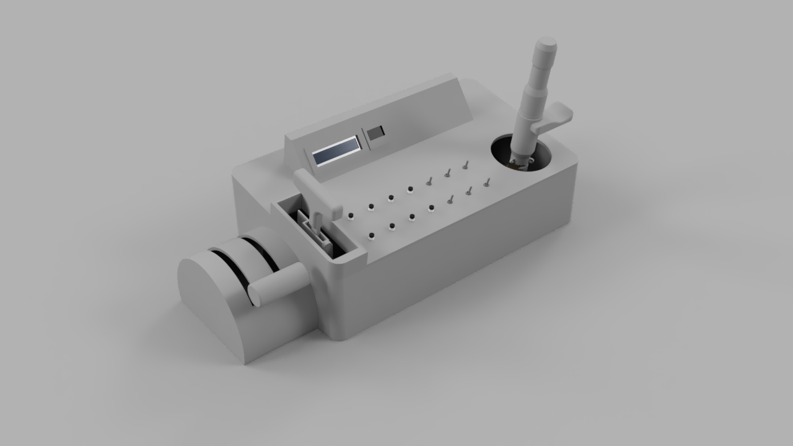

# kontroller
 
this project is -getting on it's paces but hang in there, there's lots of work to do-
#
so proceed with caution and a lot of things might change

# References
- [kRPC mod](https://www.github.com/krpc/krpc)
- [kOS mod](https://github.com/KSP-KOS/KOS)
- [LCD Display 3D Model](https://grabcad.com/library/16-x-2-lcd-display-module)
- [OLED Display 3D Model](https://grabcad.com/library/oled-128-x-64-display-1)
- [14 Segment Numerical Display 3D Model](https://grabcad.com/library/dual-digit-numeric-display-dc56-11-or-da56-11-1)
- [Trimmer Potentiometer 3D Model](https://grabcad.com/library/potentiometer-12)
- [Switch 3D Model 1](https://grabcad.com/library/small-power-switches-rocker-type-10-5x15mm-1)
- [Switch 3D Model 2](https://grabcad.com/library/spdt-print-toggle-switch-pcb-mount-1)
- [Buttons 3D Model](https://grabcad.com/library/lockless-on-off-push-button-switch-press-reset-switch-pbs-110-1)
- [G-Clamp 3D Model Thingiverse](https://www.thingiverse.com/thing:1673030)
- [Open Joystick](https://github.com/bhowiebkr/open-joystick)
(I took some ideas from open-joystick to design my stuff, it ended up being completely different, BUT I'd still like to share it because it's really cool and I learned stuff)