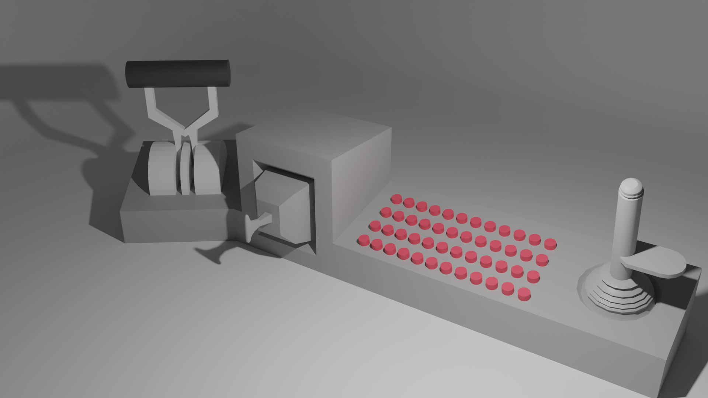

assuming my lazy ass completed the project...
#
assuming you already built everything...
#
this should be the use manual for what you could use it for on Kerbal Space Program.
#
for now it's more _the dream I want this project to be,_ and a sort of feature planner

# how to connect to krpc and ksp

- download krpc though CKAN or manually
(video that shows how to do it)
- run ksp
go to the bathroom or do something else while it loads (that's basically my experience)
- load a save and add a new kRPC server
- configure it to use the correct serial port.
- start server
- plug in the -kontroller krpc interface-
- press the CONNECT Button
- it should light up the LED and under the server, you should confirm the connectivity to the game.
- you're almost done!
- charge and turn on the kontroller, if the JunOS lights up and shows it's receiving the game's data, YOU'RE GOOD TO GO FLY SOME FRIKIN ROCKETS BAYBE

# how to really use it in game
of course, since this is an open-source project, this is going to change in whatever way you, the engineer, changed it.

### when flying rockets

##### The Attitude Kontroller Human Control Interface
- the right most control should be the joystick thing, or as I call it, The Attitude Kontroller Human Control Interface. This controls PITCH, YAW and ROLL.
- - moving it foward should make your craft's navball move south, as is in the cardinal directions of your rocket.
- - if you want to change for a control more usual to airplanes, there should be a button which does that just on the right of the joystick.
for this change, PITCH will be inverted

##### The Translation Kontroller Human Control Interface
- the cube thing with a handle on the left of the main button panel, that should be the translation controller, it's function is quite tricky to get the hang of, it's modeled after the Apollo's translation controller, which was used for the docking procedure on Lunar Orbit and Trans-Lunar trajectory for reconfiguration
- - it goes left, right, up, down, foward and backward.
- - those movements are carefully measured and translated into the RCS controls for translation, or whatever you set it on the action groups. It may be useful for many many different scenarios beyond docking procedures. The scope of my KSP projects are limitless and usually envelop the translation control for robotics used in launch pads and integration systems
- - use it anyway you want! this is just too fun to not play around with.

##### The Throttle Kontroller Human Control Interface
- goes foward to FAST
- goes backward to _slow_
it's really fun just to _feel_ like an astronaut by moving this throttle lever

##### The Kontroller's Button Panel

##### The JunOS
this is
complicated.
It's sort of another project on it's own, so there'll be (I hope) another repo about it.
It's basically a screen that shows information from the game, and also can be used as a virtual button panel if I can really make it right.
